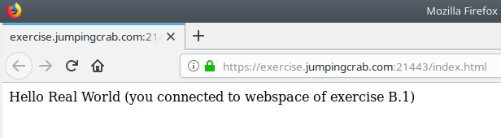

# Exercise B.1: An Intermediate Certificate (and a HTTPS Connection with an Official Server Certificate)

## Objective
You will learn what an intermediate certificate (also called chain certificate) is. Afterwards you will setup a webserver using an certificate from an official CA, using an intermediate certificate. Finally you will connect to it with your browser (and get a green lock icon.)

## What is an Intermediate Certificate (or Chain Certificate)?
The root certificates of the official Certificate Authorities (CAs) are (by default) in the truststores of billions of browsers and other clients worldwide. So exchanging one of them in a short time (e. g. if it was compromised) is hardly possible. So their private keys need to be very well protected. Usually they are stored offline in high secure facilities.

On the other hand CAs need to sign lots of certificates every day - which would be really hard to do with an offline machine (containing the CA certificate). So one level of indirection needs to be added to make it work in day-to-day business:

The (offline) Root CA signs the certificate of an (online) signing CA. And the signing CA signs certificates of the customers (e. g. server certificates, client certificates, ...). If the certificate of the signing CA was compromised, it can easily be revoked by the Root CA and a new signing CA certificate can be issued: No need to touch anything on the billions of clients.

__Next problem:__ Nobody would trust the server or client certificates. They are issued by the signing CA and their certificate is not in the truststore.

__Solution:__ Whenever I send over my certificate to my communication partner (during the TLS handshake) I do not only send my own certificate but also add the certificate of the signing CA. My communication partner can then verify my certificate against the certificate of the signing CA and the certificate of the signing CA against the certificate of the Root CA, which is in the truststore.

When including the certificate of the signing CA in the TLS handshake, we call it an intermediate certificate or chain certificate because it completes the chain of trust.

__ATTENTION:__ Make sure you __NEVER NEVER NEVER__ put some intermediate certificate into some truststore! This would only help if you messed up your TLS configuration. Of course it would work in the first place. But you will be in trouble later if the intermediate will be revoked or needs to be renewed (because it expires). All these well proven concepts will not work any longer.  
So please: __NEVER NEVER NEVER__ put some intermediate certificate into some truststore! Go ahead: Fix your messed up config instead!!

## Steps

   * Make sure you have all the additional prerequisites for chapter B in place. You find them in section "Additional Prerequisites" of the [global README](../../).

   * Setup a secure (HTTPS) virtual server within Apache using your certificate from an official CA (and the intermediate certificate):  
     Copy `exercises/B1/apache_conf.d/exercise-B1.conf` to a directory where Apache looks for configurations and edit all paths in there (to match the paths on your system - see comments in the file)
      * in CentOS / RedHat Enterprise setups do something like
        ```Bash
        ~# sudo cp exercises/B1/apache_conf.d/exercise-B1.conf /etc/httpd/conf.d/
        ~# sudo vim /etc/httpd/conf.d/exercise-B1.conf
        ```
      * and in Debian / Ubuntu / Mint you do something like
        ```Bash
        ~# sudo cp exercises/B1/apache_conf.d/exercise-B1.conf /etc/apache2/sites-available
        ~# sudo vim /etc/apache2/sites-available/exercise-B1.conf
        ```

   * Enable the config now and reload your Apache.
      * in CentOS / RedHat Enterprise setups this is
        ```Bash
        ~# sudo systemctl restart httpd
        ```
      * and in Debian / Ubuntu / Mint you do something like
        ```Bash
        ~# sudo a2ensite exercise-B1
        ~# sudo systemctl reload apache2
        ```

   * Make sure it has an TCP Listener on Port 21443 now:
     ```Bash
     ~# sudo netstat -pltn
             # or alternatively
     ~# sudo lsof | grep LISTEN
     ```

   * First test on the playground machine itself:
     ```Bash
     ~# curl https://exercise.jumpingcrab.com:21443/index.html
     Hello Real World
     (you connected to webspace of exercise B.1)
     ```
     Please note: No need to trust someone explicitly! Trust is implicitly now (because the certificate of the Root CA you did choose is in the default truststore).

   * Next test: Use the browser on your workstation to call the URL https://exercise.jumpingcrab.com:21443/index.html  
     Should look like this:  
       
     You can also click on the lock and examine the certificate details:  
     

   * If port 443 on your playground machine is not in use by some other service you could also change the port in `/etc/httpd/conf.d/exercise-B1.conf` or `/etc/apache2/sites-available/exercise-B1.conf` to `443`. In this case you do not need to give a port in the URL.

   * Optional steps:  
      - If you need a keystore (in PKCS12 format) please make sure you also add the intermediate cerificate. To place the certificate, it's private key and the intermediate certificate in a (newly created) PKCS12 keystore:  
        `openssl pkcs12 -export -in /etc/letsencrypt/live/exercise.jumpingcrab.com/cert.pem -inkey /etc/letsencrypt/live/exercise.jumpingcrab.com/privkey.pem -certfile /etc/letsencrypt/live/exercise.jumpingcrab.com/chain.pem -out exercise.jumpingcrab.com.keystore.p12`  
        (make sure you remember the keystore password you are setting here)

## Conclusion

   * You created a setup that can be used in the real world (at least in a similar way). Congratulations!
