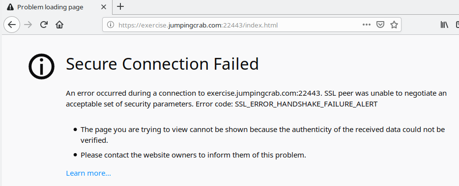
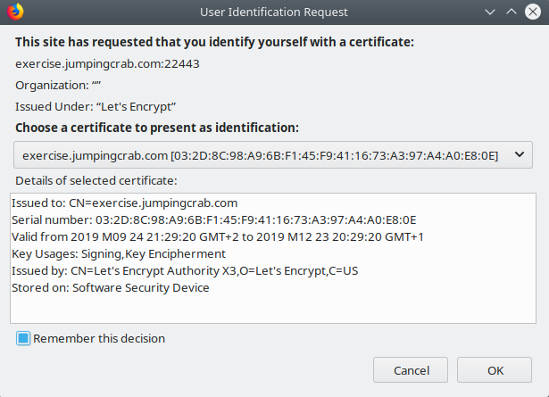
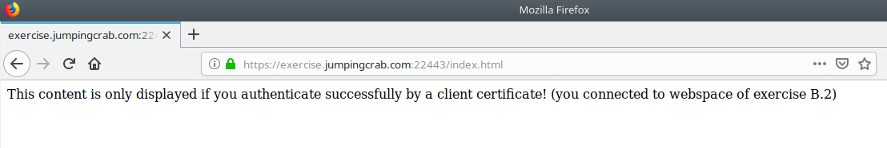

# Exercise B.2: mTLS Connection with Intermediate Certificate

## Objective

In this exercise you will create a very similar setup as in [Exercise A.4](../A4/) with a few new things:
   * You will use official certificates now.
   * An intermediate certificate will be used when the client authenticates the server.
   * An intermediate certificate will be used when the server authenticates the client.

## Prerequisites

   * Make sure you have all the additional prerequisites for chapter B in place. You find them in section "Additional Prerequisites" of the [global README](../../../../).
   * You need a client certificate issued by an official CA or corporate CA.
      - You will also need the intermediate certificate for your client certificate.
      - And you will need the root certificate of the CA issuing your client certificate.
        (Probably it will be available in the default truststore but you need to know which one it is.)
      - If you are doing this exercise with an Let's Encrypt certificate as server certificate you can use the same certificate as client certificate too. This is not really a setup you will use in your production environment, but will be absolutely ok here. It works because Let's Encrypt by default does not only add the server flag to a certificate issued, but also the client flag.
        ```Bash
        ~# sudo openssl x509 -in /etc/letsencrypt/live/exercise.jumpingcrab.com/cert.pem -noout -text | grep -A1 "Extended Key Usage:"
                    X509v3 Extended Key Usage: 
                        TLS Web Server Authentication, TLS Web Client Authentication
        ```
   * Usually the client and the server run on different machines. For this example it's absolutely ok to have both of them on one machine (your playground machine). Or you can use the browser on your workstation as client.

## Steps

   * If you are using one single Let's Encrypt Certificate in both roles (server certificate and client certificate) please copy it - for the use as client certificate - over to your home directory.
     ```Bash
     ~# mkdir ~/clientcrt
     ~# chmod 700 ~/clientcrt/
     ~# sudo readlink -f /etc/letsencrypt/live/exercise.jumpingcrab.com/cert.pem /etc/letsencrypt/live/exercise.jumpingcrab.com/chain.pem /etc/letsencrypt/live/exercise.jumpingcrab.com/fullchain.pem /etc/letsencrypt/live/exercise.jumpingcrab.com/privkey.pem
     /etc/letsencrypt/archive/exercise.jumpingcrab.com/cert1.pem
     /etc/letsencrypt/archive/exercise.jumpingcrab.com/chain1.pem
     /etc/letsencrypt/archive/exercise.jumpingcrab.com/fullchain1.pem
     /etc/letsencrypt/archive/exercise.jumpingcrab.com/privkey1.pem
     ~# sudo cp /etc/letsencrypt/archive/exercise.jumpingcrab.com/cert1.pem  /etc/letsencrypt/archive/exercise.jumpingcrab.com/chain1.pem /etc/letsencrypt/archive/exercise.jumpingcrab.com/fullchain1.pem /etc/letsencrypt/archive/exercise.jumpingcrab.com/privkey1.pem ~/clientcrt/
     ```
     This way you at least have different files for the client certificate (in `~/clientcrt/`) and for the server certificate (in `/etc/letsencrypt/live/`). From this point on: Do not care about the fact these are just copies. Imagine they are differnt!
   * Setup a secure (HTTPS) virtual server, having mTLS enabled:  
     Copy `exercises/B2/apache_conf.d/exercise-B2.conf` to a directory where Apache looks for configurations and edit all paths in there (to match the paths you choose on your system) - see comments in the file.
      * in CentOS / RedHat Enterprise setups do something like
        ```Bash
        ~# sudo cp exercises/B2/apache_conf.d/exercise-B2.conf /etc/httpd/conf.d/
        ~# sudo vim /etc/httpd/conf.d/exercise-B2.conf
        ```
      * and in Debian / Ubuntu / Mint you do something like
        ```Bash
        ~# sudo cp exercises/B2/apache_conf.d/exercise-B2.conf /etc/apache2/sites-available
        ~# sudo vim /etc/apache2/sites-available/exercise-B2.conf
        ```

   * Enable the config now and reload your Apache.
      * in CentOS / RedHat Enterprise setups this is
        ```Bash
        ~# sudo systemctl restart httpd
        ```
      * and in Debian / Ubuntu / Mint you do something like
        ```Bash
        ~# sudo a2ensite exercise-B2
        ~# sudo systemctl reload apache2
        ```

   * Make sure it has an TCP Listener on Port 22443 now:
     ```Bash
     ~# sudo netstat -pltn
             # or alternatively
     ~# sudo lsof | grep LISTEN
     ```

   * Acting as a client you need to authenticate with your client certificate. And as your client certificate is not directly issued by a Root CA in this exercise it is not sufficient to hand over just your client certificate. You additionally will need to provide the appropriate intermediate certificate within the TLS handshake to make sure the server can verify your certificate against a Root CA certificate.
       - For the use with `curl` as a client you need both certificates - the client certificate and it's intermediate - in one file in PEM format. (Just concatenated one after the other.)
       - In case you are using Let's Encrypts CertBot, it already provides such a concatenated file as `fullchain*.pem`
       - In all other cases it can easily be created by something like:
         ```Bash
         ~# cat ~/clientcrt/cert1.pem ~/clientcrt/chain1.pem > ~/clientcrt/fullchain1.pem
         ```

   * Let's test!  
     ```Bash
     ~# curl --cert ~/clientcrt/fullchain1.pem --key ~/clientcrt/privkey1.pem https://exercise.jumpingcrab.com:22443/index.html
     This content is only displayed if you authenticate successfully by a client certificate!
     (you connected to webspace of exercise B.2)
     ```

   * Negative test:  
     Let's check what happens, if we connect to the server without providing a client certificat.
     ```Bash
     ~# curl https://exercise.jumpingcrab.com:22443/index.html
     curl: (35) NSS: client certificate not found (nickname not specified)
     ```

   * Next thing is to test with the Browser on your workstation. Do the negativ test first - assume some arbitrary client (not having a valid client certificate) is trying to access your shiny new but secured website and just enters the URL https://exercise.jumpingcrab.com:22443/index.html. This should look something like this  
       
     This is the expected behavior: The server doesn't let the client in as it is not authenticated!

   * A client which should be able to access the website needs the client certificate and its private key plus the chain certificate to do a successful TLS handshake. Let's put all these into one keystore (in PKCS12 format):  
     ```Bash
     openssl pkcs12 -export -in ~/clientcrt/cert1.pem -inkey ~/clientcrt/privkey1.pem -certfile ~/clientcrt/chain1.pem -out ~/clientcrt/client.keystore.p12
     ```
     (Make sure you remember the password you are setting here for the keystore.)

   * At your workstation: Import `client.keystore.p12` in your browsers certificate store.  
     e. g. in Firefox this is Preferences -> View Certificates... -> Your Certificates -> Import...  
     (Here you need the password again you did set in the previous step.)

   * Now you should be able to access your secured website at https://exercise.jumpingcrab.com:22443/index.html  
      - Your browser first asks which client certificate should be used to authenticate at the server.
          
        Choose the one you just imported.
      - And finally you see it: The content of your secure website!  
        

## Conclusion

   * You made it up to here! Congratulations! We hope your new gained knowledge will be helpful for you!
