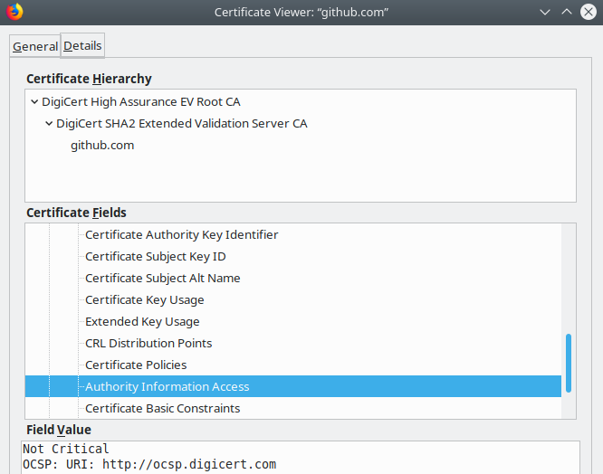

# Exercise B.3: Certificate Revocation

## Objective

In this exercise you will learn about certificate revocation and how to check if a certificate (your communication partner is presenting) is revoked.

## Preface

Security of x.509 certificates relies on the private key being kept secret. Only authorized persons / systems are allowed to access it. If this is not guaranteed any more the certificate needs to be invalidated immediatelly. This is called __certificate revocation__ in x.509 context and needs to be done at least in the following situations:

   * The private key is stolen or suspected to be stolen.
   * An attacker had access (or suspected to have access) to the system storing the private key.

Depending on regulations in your organisation you might additionally need to revoke a certificate:

   * If the owning system is deprovisioned and the remaining validity period is exceeding a certain amount of time (e. g. more than 90 days remaining)
   * A colleague left the organisation who had access to the private key.

Only the Certifcate Authority (CA) which issued the certificate is able to revoke it.

## CRL versus OCSP

Everyone verifying certificates needs a method to check if the certificate has been revoked meanwhile. Two different methods are currently used:

   * A __certificate revocation list__ (CRL) is one file containing a list of all revoked certificates issued by this CA. It is digitaly signed by the CA, has a limited validity period and is distributed via a HTTP server.  
     See also: https://en.wikipedia.org/wiki/Certificate_revocation_list

   * With the __Online Certificate Status Protocol__ (OCSP) you can send a specific query to an OCSP reponder (provided by the CA) to check the revocation status of one single certificate. For the transfer also HTTP is used. The response is also digitaly signed by the CA and also has a limited livetime.  
     See also: https://en.wikipedia.org/wiki/Online_Certificate_Status_Protocol
     - A special flavour of OSCP - called OCSP Staping - will be covered in [__Exercise B.4__](../B4/). For now we will focus on pure OCSP.

Nowadays OCSP is more widly used than CRLs.

## Revoke a Certificate

The concrete steps for revoking a certificate are a little different from CA to CA. Please see instructions provided by the Certificate Authority (CA) which issued the certificate.

## Check for Revocation

__IMPORTANT:__ For fully verifying a certificate presented to you by your communication partner, make sure you do not only check the validity of the certificate but also to check it for revocation. Your communication partner might be a server you are connecting to (presenting a server certificate) or - in mTLS usecase - also a client (authenticating by a client certificate).

Most Browsers nowadays do check revocation of server certificates by default. Other software components and libraries often (by default) don't. Make sure to configure a proper check! (You will do this in an example in a few moments.)

Each certificate contains the URL where the according CRL can be retrieved, or the URL of the according OCSP responder. Or if you are really lucky: Both (in this case you have the free choice on which to use).

## Steps

### Display Content of CRL

   * Point your browser to https://github.com/ and examine the certificate. Probably it will contain both (at least for now - October 2019 - it does). One or more CRL URL(s):  
      within the certificate")  
     And a OCSP URL:  
     

   * You can use the CRL URL (just found out) to download it and have a look at it:  
     ```Bash
     ~# wget -O /tmp/crl.for.github.com.crl http://crl3.digicert.com/sha2-ev-server-g2.crl
     --2019-11-21 06:58:53--  http://crl3.digicert.com/sha2-ev-server-g2.crl
     Resolving crl3.digicert.com (crl3.digicert.com)... 93.184.220.29
     Connecting to crl3.digicert.com (crl3.digicert.com)|93.184.220.29|:80... connected.
     HTTP request sent, awaiting response... 200 OK
     Length: 896693 (876K) [application/x-pkcs7-crl]
     Saving to: ‘/tmp/crl.for.github.com.crl’

     /tmp/crl.for.github.com.crl     100%[=======================================================>] 875.68K   444KB/s    in 16s

     56.0 KB/s - ‘/tmp/crl.for.github.com.crl’ saved [896693/896693]
     ```

     ```Bash
     ~# openssl crl -in /tmp/crl.for.github.com.crl -inform der -noout -text
     Certificate Revocation List (CRL):
             Version 2 (0x1)
             Signature Algorithm: sha256WithRSAEncryption
             Issuer: C = US, O = DigiCert Inc, OU = www.digicert.com, CN = DigiCert SHA2 Extended Validation Server CA
             Last Update: Oct 21 21:36:27 2019 GMT
             Next Update: Oct 28 21:36:27 2019 GMT
             CRL extensions:
                 X509v3 Authority Key Identifier: 
                     keyid:3D:D3:50:A5:D6:A0:AD:EE:F3:4A:60:0A:65:D3:21:D4:F8:F8:D6:0F

                 X509v3 CRL Number: 
                     861
                 X509v3 Issuing Distribution Point: critical
                     Full Name:
                       URI:http://crl3.digicert.com/sha2-ev-server-g2.crl

     Revoked Certificates:
         Serial Number: 039F0B833D605C80AADFA805BBF8BF71
             Revocation Date: Sep  1 18:14:59 2017 GMT
         Serial Number: 0FE92680E5D4D721F88FD7311BBD950A
             Revocation Date: Sep 11 19:00:19 2017 GMT
         Serial Number: 052F967F3E35CEB82A5925211B7E3E7F
             Revocation Date: Sep 16 09:03:21 2017 GMT
         Serial Number: 0A077759472127F2EC03B99D2677247F
             Revocation Date: Sep 22 15:26:34 2017 GMT
         Serial Number: 04E73B9986FCB24355B0C5525F30FADF
             Revocation Date: Sep 23 19:09:05 2017 GMT
         Serial Number: 01AC27990B900397CC6E0930471416A7
             Revocation Date: Sep 25 18:37:48 2017 GMT
         Serial Number: 0B866584D82860A3EDB4A9FB9FC69678
     [...]
     ```
     You can see:
        - When the CRL was created
        - When it will expire
        - A (long) list of serial numbers of revoked certificates together with it's revocation date and maybe a reason for revocation

### Check a Certificate against OCSP (manually)

   * Retrieve the server certificate from the server and save it to a file.  
     (This is the certificate we want to check in a few moments.)  
     ```Bash
     ~# openssl s_client -connect github.com:443 </dev/null | sed -n '/-----BEGIN/,/-----END/p' >/tmp/github.com.pem
     depth=2 C = US, O = DigiCert Inc, OU = www.digicert.com, CN = DigiCert High Assurance EV Root CA
     verify return:1
     depth=1 C = US, O = DigiCert Inc, OU = www.digicert.com, CN = DigiCert SHA2 Extended Validation Server CA
     verify return:1
     depth=0 businessCategory = Private Organization, jurisdictionC = US, jurisdictionST = Delaware, serialNumber = 5157550, C = US, ST = California, L = San Francisco, O = "GitHub, Inc.", CN = github.com
     verify return:1
     DONE
     ```

   * For checking against OCSP we also need the intermediate certificate. Let's retrieve this one now too:  
     ```Bash
     ~# openssl s_client -showcerts -connect github.com:443 </dev/null | sed -n '/-----BEGIN/,/-----END/p' >/tmp/github.com.chain.pem 
     depth=2 C = US, O = DigiCert Inc, OU = www.digicert.com, CN = DigiCert High Assurance EV Root CA
     verify return:1
     depth=1 C = US, O = DigiCert Inc, OU = www.digicert.com, CN = DigiCert SHA2 Extended Validation Server CA
     verify return:1
     depth=0 businessCategory = Private Organization, jurisdictionC = US, jurisdictionST = Delaware, serialNumber = 5157550, C = US, ST = California, L = San Francisco, O = "GitHub, Inc.", CN = github.com
     verify return:1
     DONE
     ```

   * In `/tmp/github.com.chain.pem` now there are two certificates, the server certificate and the intermediate. We only need the intermediate certificate. Delete the first certificate block now. This can be done with your favourite text editor or by:  
     ```Bash
     ~# sed -i '0,/^-----END CERTIFICATE-----$/d' /tmp/github.com.chain.pem
     ```

   * From the certifcate to check you can extract the OCSP URL by:  
     ```Bash
     ~# openssl x509 -in /tmp/github.com.pem -noout -ocsp_uri
     http://ocsp.digicert.com
     ```  
     Use the URL found here in the next step for the `-url` parameter.

   * Now you have everything ready to really check against the CA's OCSP handler:  
     ```Bash
     ~# openssl ocsp -issuer /tmp/github.com.chain.pem -cert /tmp/github.com.pem -text -url http://ocsp.digicert.com

     OCSP Request Data:
         Version: 1 (0x0)
         Requestor List:
             Certificate ID:
               Hash Algorithm: sha1
               Issuer Name Hash: 49F4BD8A18BF760698C5DE402D683B716AE4E686
               Issuer Key Hash: 3DD350A5D6A0ADEEF34A600A65D321D4F8F8D60F
               Serial Number: 0A0630427F5BBCED6957396593B6451F
         Request Extensions:
             OCSP Nonce: 
                 041015510200F4B569CCAA069B5E2311ECE5
     OCSP Response Data:
         OCSP Response Status: successful (0x0)
         Response Type: Basic OCSP Response
         Version: 1 (0x0)
         Responder Id: 3DD350A5D6A0ADEEF34A600A65D321D4F8F8D60F
         Produced At: Oct 22 20:09:41 2019 GMT
         Responses:
         Certificate ID:
           Hash Algorithm: sha1
           Issuer Name Hash: 49F4BD8A18BF760698C5DE402D683B716AE4E686
           Issuer Key Hash: 3DD350A5D6A0ADEEF34A600A65D321D4F8F8D60F
           Serial Number: 0A0630427F5BBCED6957396593B6451F
         Cert Status: good
         This Update: Oct 22 20:09:41 2019 GMT
         Next Update: Oct 29 19:24:41 2019 GMT

         Signature Algorithm: sha256WithRSAEncryption
              0f:45:59:82:44:81:2f:be:1d:22:5b:af:bb:cf:1d:98:b8:72:
              ed:fa:c7:cb:76:5f:28:65:78:ce:1b:91:19:aa:e2:03:2b:6a:
              c0:73:d4:80:23:e0:d7:d0:c6:34:42:47:fc:21:57:44:13:47:
              3f:06:a6:f3:c2:a3:18:cb:62:7a:7a:c4:73:9c:87:85:6a:d0:
              72:56:73:83:fd:35:b7:77:fb:4c:75:0c:ea:0a:8f:7c:d2:45:
              c6:3e:ff:76:d6:ac:3c:2b:71:50:c5:36:b4:2b:7a:11:d0:58:
              75:4b:dd:6e:b5:33:a2:4b:93:8c:d3:5f:90:cb:08:f7:b8:76:
              8e:d3:77:9b:ce:8a:f2:71:0c:60:f5:49:4c:d7:ea:c3:d9:a3:
              02:ad:b5:18:b2:b6:a5:32:c4:8a:34:a2:b2:8b:61:1e:54:7b:
              40:1c:8b:0e:bb:d7:46:77:32:0f:82:46:b2:f7:92:79:74:c4:
              36:b4:17:dc:50:25:a2:9e:23:1c:5c:a3:61:98:15:a3:be:a2:
              e0:54:6f:b8:82:ce:26:3d:e9:5b:fc:1a:a5:39:cd:be:2c:8e:
              3f:20:c8:91:3d:39:e7:0b:b1:a8:ee:3a:03:76:9e:52:67:14:
              10:e9:6b:17:f3:d9:a7:b4:5d:c2:e7:5d:63:88:ad:b0:ad:bf:
              df:90:19:9f
     WARNING: no nonce in response
     Response verify OK
     /tmp/github.com.pem: good
        This Update: Oct 22 20:09:41 2019 GMT
        Next Update: Oct 29 19:24:41 2019 GMT
     ```

### Always check for revocation (automatically)

To continue with the next steps you need to have finished [__Exercise B.2__](../B2/). There you did set up a webserver where clients need to authenticate with a client certificate.

   * Until you have everything working please switch the loglevel for the B.2 VirtualHost to `debug` to make sure you can see what's going on (in Apache's error log) - not only to see what concretly is going wrong if there should be errors, but also to read the log and learn from it about the single steps taken.  
     Please edit your Apache's `exercise-B2.conf` file and inside the `VirtualHost` section add:  
     ```Bash
     LogLevel debug
     ```  

   * Reload your Apache now:
      * in CentOS / RedHat Enterprise setups this is
        ```Bash
        ~# sudo systemctl reload httpd
        ```
      * and in Debian / Ubuntu / Mint you do something like
        ```Bash
        ~# sudo systemctl reload apache2
        ```

   * And please repeat the test from exercise B.2:  
     ```Bash
     ~# curl --cert ~/clientcrt/fullchain1.pem --key ~/clientcrt/privkey1.pem https://exercise.jumpingcrab.com:22443/index.html
     This content is only displayed if you authenticate successfully by a client certificate!
     (you connected to webspace of exercise B.2)
     ```

   * Check the your Apache's error log now. In might be located somewhere under `/var/log/httpd/` or `/var/log/apache2/` or where ever you configured it to be. Look for lines looking like this:  
     ```Bash
     [...] [client 127.0.0.1:51388] AH02275: Certificate Verification, depth 2, CRL checking mode: none (0) [subject: CN=DST Root CA X3,O=Digital Signature Trust Co. / issuer: CN=DST Root CA X3,O=Digital Signature Trust Co. / serial: 44AFB080D6A327BA893039862EF8406B / notbefore: Sep 30 21:12:19 2000 GMT / notafter: Sep 30 14:01:15 2021 GMT]
     [...] [client 127.0.0.1:51388] AH02275: Certificate Verification, depth 1, CRL checking mode: none (0) [subject: CN=Let's Encrypt Authority X3,O=Let's Encrypt,C=US / issuer: CN=DST Root CA X3,O=Digital Signature Trust Co. / serial: 0A0141420000015385736A0B85ECA708 / notbefore: Mar 17 16:40:46 2016 GMT / notafter: Mar 17 16:40:46 2021 GMT]
     [...] [client 127.0.0.1:51388] AH02275: Certificate Verification, depth 0, CRL checking mode: none (0) [subject: CN=exercise.jumpingcrab.com / issuer: CN=Let's Encrypt Authority X3,O=Let's Encrypt,C=US / serial: 032D8C98A96BF145F9411673A397A4A0E80E / notbefore: Sep 24 19:29:20 2019 GMT / notafter: Dec 23 19:29:20 2019 GMT]
     ```

   * Please especially note: It says `CRL checking mode: none (0)` in every of these lines!!  
     Apache expects explicit configuration on how to check revocation of the certificate presented by the client - otherwise it will do no revocation check at all.

   * So next step: Decide which technology you want to use for the revocation check. If your client certificates offers one technology only the choice is easy. For all other cases let's have a look:

#### PROs and CONs of OCSP

   * You always get the current state of revocation. (Almost no delay between revocation of the certificate and the time the server no longer accepts it.)
   * One additional network connection (between server and OCSP handler) during each TLS handshake. (This takes a little extra time.)
   * You rely on the availability of the OCSP handler: If the OCSP handler (operated by the CA) is unavailable, clients are unable to request anything from your webserver because every TLS handshake will be unsuccessful.
   * Maybe privacy concerns: The CA could - by analyzing the access logs of the OCSP handler - track the usage of every certificate because they get one request within every TLS handshake. (IP address, timestamp, ...)

#### PROs and CONs of CRLs

   * More efficient and faster: You download the CRLs once and evaluate multiple certificates against it. During the TLS handshake you need to read local files only.
   * You need to care yourself for a job regularly downloading the current version of the CRLs.
   * Longer time between certificate revocation and the point in time you no longer accept it - depending on how often you refresh the local copy of the CRLs.

#### If You Decide to Use OCSP

   * Edit your Apache's `exercise-B2.conf` file and inside the `VirtualHost` section add:  
     ```Bash
     SSLOCSPEnable on
     ```

   * The OCSP handler used above (Let's Encypt) does not provide Nonces. In the listing above please note the line:  
     ```Bash
     WARNING: no nonce in response
     ```  
     If your CA's OCSP handler also does not provide Nonces please additionally put  
     ```Bash
     SSLOCSPUseRequestNonce off
     ```  
     into your Apache's `exercise-B2.conf` file.

   * And if your CA's OCSP responder does omit the chain certificate in its reponse you additionally need to configure `SSLOCSPResponderCertificateFile` to point to the intermediate certificate of your client certificate. Something like:  
     ```Bash
     SSLOCSPResponderCertificateFile /path/to/clientcrt/chain1.pem
     ```

   * Reload your Apache now:
      * in CentOS / RedHat Enterprise setups this is
        ```Bash
        ~# sudo systemctl reload httpd
        ```
      * and in Debian / Ubuntu / Mint you do something like
        ```Bash
        ~# sudo systemctl reload apache2
        ```

   * And test again:  
     ```Bash
     ~# curl --cert ~/clientcrt/fullchain1.pem --key ~/clientcrt/privkey1.pem https://exercise.jumpingcrab.com:22443/index.html
     This content is only displayed if you authenticate successfully by a client certificate!
     (you connected to webspace of exercise B.2)
     ```

   * If the test fails you find information on what went wrong in your Apache's error log file (because you switched the loglevel to debug).

   * As soon you got it working please have one more look into the error log file. There again you find lines like this:  
     ```Bash
     [...] [client 127.0.0.1:41942] AH02275: Certificate Verification, depth 2, CRL checking mode: none (0) [subject: CN=DST Root CA X3,O=Digital Signature Trust Co. / issuer: CN=DST Root CA X3,O=Digital Signature Trust Co. / serial: 44AFB080D6A327BA893039862EF8406B / notbefore: Sep 30 21:12:19 2000 GMT / notafter: Sep 30 14:01:15 2021 GMT]
     [...] [client 127.0.0.1:41942] AH02275: Certificate Verification, depth 1, CRL checking mode: none (0) [subject: CN=Let's Encrypt Authority X3,O=Let's Encrypt,C=US / issuer: CN=DST Root CA X3,O=Digital Signature Trust Co. / serial: 0A0141420000015385736A0B85ECA708 / notbefore: Mar 17 16:40:46 2016 GMT / notafter: Mar 17 16:40:46 2021 GMT]
     [...] [client 127.0.0.1:41942] AH02275: Certificate Verification, depth 0, CRL checking mode: none (0) [subject: CN=exercise.jumpingcrab.com / issuer: CN=Let's Encrypt Authority X3,O=Let's Encrypt,C=US / serial: 032D8C98A96BF145F9411673A397A4A0E80E / notbefore: Sep 24 19:29:20 2019 GMT / notafter: Dec 23 19:29:20 2019 GMT]
     ```  
     telling there are still no CRL checks.  
     On the other hand you will find lines like these, telling OCSP checks succeeded:  
     ```Bash
     [...] [client 127.0.0.1:41942] AH03239: OCSP validation completed, certificate status: good (0, -1) [subject: CN=Let's Encrypt Authority X3,O=Let's Encrypt,C=US / issuer: CN=DST Root CA X3,O=Digital Signature Trust Co. / serial: 0A0141420000015385736A0B85ECA708 / notbefore: Mar 17 16:40:46 2016 GMT / notafter: Mar 17 16:40:46 2021 GMT]
     [...] [client 127.0.0.1:41942] AH03239: OCSP validation completed, certificate status: good (0, -1) [subject: CN=exercise.jumpingcrab.com / issuer: CN=Let's Encrypt Authority X3,O=Let's Encrypt,C=US / serial: 032D8C98A96BF145F9411673A397A4A0E80E / notbefore: Sep 24 19:29:20 2019 GMT / notafter: Dec 23 19:29:20 2019 GMT]
     ```

#### If You Decide to Use CRL

This part can not be done with my Let's Encrypt certificate (used in the role of a client certificate) because it does not provide a CRL URL. So I will use a different client certificate for the next steps. I made sure `SSLCACertificateFile` in my Apache's `exercise-B2.conf` is pointing to the corresponding Root CA certificate.

   * Create a directory where to store the CRLs locally. I will use `/etc/httpd/ssl.crl`  
     ```Bash
     mkdir /etc/httpd/ssl.crl
     ```

   * Check as well the client certificate as it's intermediate CA certificate for it's CRL URL. This can be done in the way you did above or by:  
     ```Bash
     ~# openssl x509 -in ~/clientcrt/client.pem -noout -text | grep -A 4 "X509v3 CRL Distribution Points"
     ```  
     (The client certificate itself contains the CRL URL of it's issuing CA - which in this case it the intermediate CA.)  
     and  
     ```Bash
     ~# openssl x509 -in ~/clientcrt/issuing_ca.cert.pem -noout -text | grep -A 4 "X509v3 CRL Distribution Points"
     ```  
     (The intermediate certificate contains the CRL URL of it's issuing CA - which in this case it the Root CA.)

   * Download both CRLs.

   * For both files check if they are in PEM format:
     ```Bash
     ~# grep "BEGIN X509 CRL" issuing_ca.crl >/dev/null && echo PEM || echo DER
     PEM
     ```  
     (and the same for the Root CA CRL)

   * If they are in PEM format everything is ok.  
     If they are in DER format please convert them into PEM:  
     ```Bash
     ~# openssl crl -in issuing_ca.crl -inform DER -out issuing_ca.crl.pem -outform PEM
     ```  
     (and the same for the Root CA CRL)

   * Copy the both files in PEM format into the directory created above:  
     ```Bash
     ~# sudo cp issuing_ca.crl.pem root_ca.crl.pem /etc/httpd/ssl.crl
     ```

   * For efficiency reasons Apache looks up certificates in the directory in their HASH representation. So you need to provide symlinks:  
     ```Bash
     ~# cd /etc/httpd/ssl.crl
     ~# sudo ln -s issuing_ca.crl.pem $(openssl crl -hash -noout -in issuing_ca.crl.pem).r0
     ~# sudo ln -s root_ca.crl.pem $(openssl crl -hash -noout -in root_ca.crl.pem).r0
     ```  
     After this it should look something like this:  
     ```Bash
     ~# ls -l
     total 8
     lrwxrwxrwx. 1 root root   18 Nov 12 07:30 39933da4.r0 -> issuing_ca.crl.pem
     lrwxrwxrwx. 1 root root   15 Nov 12 07:30 723d8e7e.r0 -> root_ca.crl.pem
     -rw-r--r--. 1 root root 1105 Nov 12 06:52 issuing_ca.crl.pem
     -rw-r--r--. 1 root root 1129 Nov 12 06:52 root_ca.crl.pem
     ```

   * Edit your Apache's `exercise-B2.conf` file and inside the `VirtualHost` section add:  
     ```Bash
     SSLCARevocationCheck chain
     SSLCARevocationPath /etc/httpd/ssl.crl/
     ```

   * Reload your Apache now:
      * in CentOS / RedHat Enterprise setups this is
        ```Bash
        ~# sudo systemctl reload httpd
        ```
      * and in Debian / Ubuntu / Mint you do something like
        ```Bash
        ~# sudo systemctl reload apache2
        ```

   * And test again:  
     ```Bash
     ~# curl --cert ~/clientcrt/client.fullchain.pem --key ~/clientcrt/client.privkey.pem https://exercise.jumpingcrab.com:22443/index.html
     This content is only displayed if you authenticate successfully by a client certificate!
     (you connected to webspace of exercise B.2)
     ```

   * If the test fails you find information on what went wrong in your Apache's error log file (because you switched the loglevel to debug).

   * As soon you got it working please have one more look into the error log file. There again you find lines like this:  
     ```Bash
     [...] [client 127.0.0.1:41930] AH02275: Certificate Verification, depth 2, CRL checking mode: chain (2) [subject: [...]
     [...] [client 127.0.0.1:41930] AH02275: Certificate Verification, depth 1, CRL checking mode: chain (2) [subject: [...]
     [...] [client 127.0.0.1:41930] AH02275: Certificate Verification, depth 0, CRL checking mode: chain (2) [subject: [...]
     ```  
     Please note, now it says: `CRL checking mode: chain`

   * In a real world scenario please remember to set up a cron job which on a regular basis gets new versions of the CRLs. Steps like above: Download them, maybe convert to PEM format, hash them.  
     You need to run it always before expiration of the CRL at minimum. Recommendation is to do it way more often. (If you get them more often you reduce the time window for abuse: Time between revocation and disabling usage.)

   * Optional step: If you want you can revoke the client certificate and see it is no longer accepted:
      - Request revocation at the CA which issued it.
      - Give it a little time to create and publish the new CRL.
      - Download the new CRL, place it in `/etc/httpd/ssl.crl` and HASH it. (No need to reload Apache.)
      - Test again:  
        ```Bash
        ~# curl --cert ~/clientcrt/client.fullchain.pem --key ~/clientcrt/client.privkey.pem https://exercise.jumpingcrab.com:22443/index.html
        curl: (56) OpenSSL SSL_read: error:14094414:SSL routines:ssl3_read_bytes:sslv3 alert certificate revoked, errno 0
        ```  
        You see the request is rejected and as a reason it says `certificate revoked`
      - At the same time in Apache's error log you will find a message like `AH02276: Certificate Verification: Error (23): certificate revoked`

## Conclusion

   * Always keep in mind: Make sure to always check for revocation - for reasons of your own secuity!
   * Please continue to [__Exercise B.4__](../B4/) to learn about OCSP Stapling: It improves performance and reduces dependency on the availability of your CA's OCSP handler.
